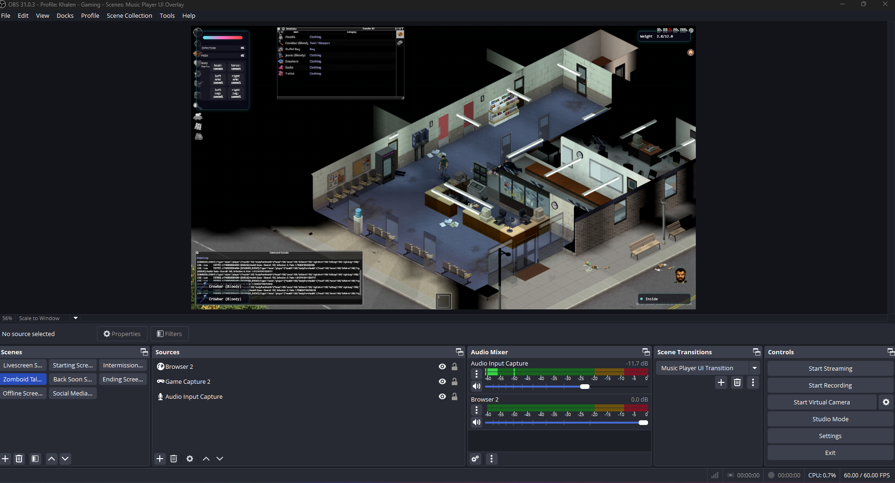

# Project Zomboid Twitch Integration

A real-time integration system that connects Project Zomboid gameplay events with Twitch chat, featuring a transparent overlay for viewer messages.

## Overview

This project consists of three main components:

1. **Lua Mod** (`media/lua/client/ZomboidEventMod.lua`): A Project Zomboid mod that tracks and logs game events
2. **Event Daemon** (`event_daemon.py`): A Python service that reads game events and broadcasts them via WebSocket
3. **Transparent Overlay** (`overlay/`): A web-based overlay that displays Twitch chat messages in-game

## Screenshot



## Features

- Real-time tracking of player stats and events
- WebSocket-based event broadcasting
- Transparent overlay for Twitch chat messages
- Cross-platform support (Windows/WSL/Linux/macOS)
- Configurable event tracking and logging

## Talking Head Overlay

The system includes an advanced image processing module that creates a dynamic talking head overlay for streamers. This feature:

1. **Face Capture**: Automatically captures and crops the player's face from the character screen
2. **Sprite Sheet Generation**: Creates a 2x2 grid sprite sheet with different facial expressions:
   - Neutral expression
   - Light talking
   - Shouting
   - Raised eyebrow/smirk
3. **DALL-E Integration**: Uses AI to generate pixel art-style talking head sprites
4. **Dynamic Animation**: Animates the talking head based on chat activity and message intensity

The image processing module (`image_processor.py`) handles:
- Automatic face detection and cropping
- Sprite sheet creation and management
- AI-powered sprite generation
- Expression mapping to chat events

## Setup Instructions

### 1. Install the Lua Mod

1. Copy the `media` folder to your Project Zomboid mods directory
2. Enable the mod in the Project Zomboid launcher

### 2. Start the Event Daemon

```bash
# Install dependencies
pip install -r requirements.txt

# Start the daemon
python event_daemon.py
```

Optional arguments:
- `--events-file`: Path to events.json (default: auto-detected)
- `--screenshot-path`: Path to the screenshot file for face capture (default: auto-detected)
- `--host`: WebSocket server host (default: localhost)
- `--port`: WebSocket server port (default: 8080)
- `--log-level`: Logging level (default: INFO)

## Configuration

### Event Daemon

The event daemon can be configured using command-line arguments or by modifying the default values in `event_daemon.py`.

### Lua Mod

The mod's configuration can be adjusted in `ZomboidEventMod.lua`:
- `EVENT_FILE`: Path to write events
- `debug`: Enable/disable debug logging
- `stateUpdateInterval`: Interval for state updates (in milliseconds)

### Cross-Platform Path Configuration

The system automatically handles path differences between operating systems. You can also customize paths using environment variables:

- `ZOMBOID_USER_DIR`: Custom path to your Project Zomboid user directory (contains Saves, Screenshots, etc.)
- `ZOMBOID_INSTALL_DIR`: Custom path to your Project Zomboid installation directory

#### Windows and WSL

When running in WSL (Windows Subsystem for Linux) while Project Zomboid runs on Windows, the system automatically converts paths between formats:

```
Windows path: C:\Users\YourName\Zomboid\Saves\events.json
WSL path: /mnt/c/Users/YourName/Zomboid/Saves/events.json
```

#### Linux and macOS

On native Linux and macOS, the system looks for Project Zomboid directories in their standard locations.

## Event Types

The system tracks various game events including:
- Player state updates
- XP gains
- Zombie kills
- Player stats and position

## Development

### Project Structure

```
.
├── media/                 # Project Zomboid mod files
│   └── lua/
│       └── client/
│           └── ZomboidEventMod.lua
├── overlay/              # Transparent overlay web app
│   ├── src/
│   ├── index.html
│   └── package.json
├── event_daemon.py      # Python event daemon
├── scripts/             # Utility scripts
│   └── extract_textures.py  # Extract game textures
├── requirements.txt     # Python dependencies
└── README.md
```

### Utility Scripts

- `scripts/extract_textures.py`: Extracts Project Zomboid item icons for use in the overlay
  - Automatically detects your Project Zomboid installation
  - Can be configured with the `--zomboid-path` argument

### Contributing

1. Fork the repository
2. Create a feature branch
3. Commit your changes
4. Push to the branch
5. Create a Pull Request

## License

This project is licensed under the MIT License - see the LICENSE file for details.
